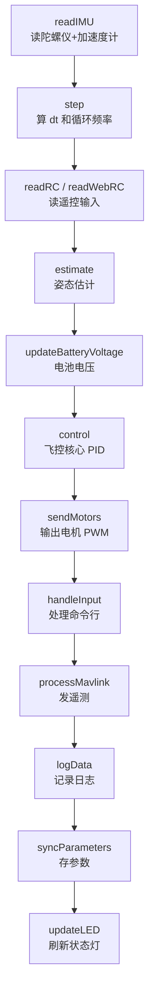

<!-- markdownlint-disable MD022 MD031 MD032 MD040 MD058 MD060 -->
<!-- 说明：本文含大量 ASCII 示意图与紧凑表格，部分 markdownlint 排版规则不适用，故按规则编号关闭 -->

# CF-Drone 源码导读

> 这份文档帮你快速看懂这套飞控代码。**建议先读本文，再读源码**。

---

## 一、这是什么东西

一套基于 **ESP32 + Arduino 框架** 的四旋翼飞控固件，硬件是开源项目「琛光 E1」系列。

| 项目 | 说明 |
|---|---|
| 芯片 | ESP32 / ESP32-S3 / ESP32-C3（自动适配，见 `board_config.h`） |
| IMU | MPU6500 / MPU9250（SPI 接口） |
| 遥控 | CRSF/ELRS（默认）或 SBUS |
| 电机 | 4 路 PWM（LEDC），可直驱 MOSFET 或接 ESC |
| 上位机 | 网页遥控器（手机浏览器）+ MAVLink 地面站 |

---

## 二、建议阅读顺序

**不要从 `CF-Drone.ino` 一头扎进去**，按下面顺序读会顺很多：

```
第 1 步  CF-Drone.ino        ← 只看 setup() 和 loop()，搞清楚"每帧都干了哪 15 件事"
第 2 步  control.ino         ← 核心！飞控算法全在这，配合本导读第五节看
第 3 步  pid.h              ← 先看懂 PID 是什么，再回头看 control.ino 会豁然开朗
第 4 步  estimate.ino        ← 姿态是怎么"算"出来的（陀螺仪积分 + 加速度计修正）
第 5 步  motors.ino          ← 控制量怎么变成电机 PWM
第 6 步  safety.ino          ← 出了事怎么保护（失联、低电、倒置）
第 7 步  imu.ino / rc.ino    ← 传感器和遥控器怎么读
第 8 步  其余文件             ← WiFi / MAVLink / 日志 / CLI，按需看
```

**数学基础**（`vector.h` / `quaternion.h`）：不用一上来就啃，
遇到 `Quaternion::rotateVector(...)` 这类调用时再回去查即可。这两个文件我都加了详细注释。

---

## 三、文件职责速查表

### 主流程
| 文件 | 职责 | 重要度 |
|---|---|---|
| `CF-Drone.ino` | 入口：`setup()` 初始化 + `loop()` 每帧调度 | ★★★ |
| `control.ino` | **飞控核心**：串级 PID、混控、解锁逻辑 | ★★★★★ |
| `estimate.ino` | 姿态估计（互补滤波） | ★★★★ |
| `pid.h` | PID 控制器 | ★★★★★ |
| `lpf.h` | 低通滤波器 | ★★★★ |
| `util.h` | 小工具（映射/限速器/延时确认） | ★★★ |

### 数学库
| 文件 | 职责 |
|---|---|
| `vector.h` | 三维向量（加减/点积/叉积/旋转向量） |
| `quaternion.h` | 四元数（姿态表示、坐标旋转） |
| `control.h` | 飞行模式枚举 + 函数声明 |

### 硬件与外设
| 文件 | 职责 |
|---|---|
| `board_config.h` | **板级引脚配置**，按芯片型号条件编译 |
| `imu.ino` | IMU 初始化、读取、校准 |
| `motors.ino` | 电机 PWM 输出（LEDC） |
| `rc.ino` | 遥控接收（CRSF/SBUS 解析） |
| `battery.ino` | 电池电压 ADC 采样 |
| `led.ino` | 状态灯（待机灭 / 飞行慢闪 / 告警快闪） |
| `time.ino` | 主循环计时（算 `dt` 和循环频率） |

### 通信与调试
| 文件 | 职责 |
|---|---|
| `wifi.ino` | WiFi AP/STA 模式、UDP |
| `web_rc.ino` | 网页遥控**服务端**（HTTP 接口） |
| `web_rc_html.h` | 网页遥控**前端**（HTML/JS，看懂飞控逻辑可跳过） |
| `mavlink.ino` | MAVLink 遥测（给 QGroundControl 等地面站看） |
| `cli.ino` | 串口/网页控制台命令行 |
| `parameters.ino` | 参数存储（Flash/NVS） |
| `log.ino` | 内存日志（飞行黑匣子） |
| `safety.ino` | 失效保护 |
| `drivers/` | 第三方驱动（Bolder Flight 的 MPU9250、SBUS 库） |
| `drivers.cpp` | 编译入口，只为把 `drivers/` 纳入编译 |

---

## 四、主循环数据流

`loop()` 每帧（约 1ms，即 ~1kHz）按固定顺序跑一遍：



**顺序很重要**：必须先读传感器 → 再估姿态 → 再算控制 → 最后输出电机。
任何环节的数据都是"本帧最新"的，不存在用旧数据算控制的问题。

---

## 五、核心概念（理解了这些，代码就不难了）

### 1. 坐标系：FLU（前-左-上）

```
        z (上)
        |
        |
        +------ y (左)
       /
      x (前)      ← 机头方向
```

- 本项目用 **FLU**（Forward-Left-Up），这是航空航天常用约定。
- **MAVLink 用的是 FRD（前-右-下）**，所以 `mavlink.ino` 里能看到 `-attitude.y`、`-attitude.z` 这种取反，就是在做坐标转换。
- 摇杆右推要让飞机**顺时针**转，而 z 轴正向是逆时针 → 所以代码里常写 `-controlYaw`。

### 2. 四元数：为什么不用欧拉角

姿态用四元数 `(w, x, y, z)` 表示，而不是"俯仰/横滚/偏航"三个角。

原因：欧拉角有机头竖直时会"万向节死锁"（横滚和偏航分不清）。
四元数没有这个奇点。**代价是：不直观**。

`quaternion.h` 里两个函数是本项目用得最多的：
- `Quaternion::rotate(attitude, 小旋转)` —— 姿态再叠加一个小旋转（陀螺仪积分靠它）
- `Quaternion::rotateVector(Vector(0,0,1), attitude)` —— 拿到当前姿态下的"上方向"，用于算姿态误差

### 3. 串级 PID（两级串联）

这是整套代码里最核心的设计：

```
   摇杆/目标姿态        姿态误差          目标角速率        角速率误差        电机力矩
        │                  │                 │                │               │
        ▼                  ▼                 ▼                ▼               ▼
   attitudeTarget ──► 【外环 角度环】 ──► ratesTarget ──► 【内环 角速率环】 ──► torqueTarget
      (目标)            controlAttitude()      (目标)          controlRates()     (力矩)
                                                              
        实际姿态 attitude ◄── estimate.ino ◄── 陀螺仪 gyro / 加速度计 acc
```

- **外环（角度环）**：飞机现在歪了 10°，那就命令它用某速率往回转。
  用 `rollPID` / `pitchPID` / `yawPID`。
- **内环（角速率环）**：不管姿态，只管"实际转多快"和"目标转多快"的差。
  用 `rollRatePID` / `pitchRatePID` / `yawRatePID`。

**为什么这么绕？** 内环跑得快，能快速抵抗外部扰动（如阵风）；
外环保证最终姿态正确。这是多旋翼飞控的标准架构。

对应代码就是 `control.ino` 里连续的三个函数：
```
controlAttitude()  →  controlRates()  →  controlTorque()
```

### 4. 电机混控（X 型）

`controlTorque()` 里这一段是"力矩怎么分配给 4 个电机"：

```cpp
motors[MOTOR_FRONT_LEFT]  = thrustTarget + torqueTarget.x - torqueTarget.y + torqueTarget.z;
motors[MOTOR_FRONT_RIGHT] = thrustTarget - torqueTarget.x - torqueTarget.y - torqueTarget.z;
motors[MOTOR_REAR_LEFT]   = thrustTarget + torqueTarget.x + torqueTarget.y - torqueTarget.z;
motors[MOTOR_REAR_RIGHT]  = thrustTarget - torqueTarget.x + torqueTarget.y + torqueTarget.z;
```

读法：**基础推力 `thrustTarget`，加上各轴的修正量**。

- `x` 是横滚力矩：左边两个电机 `+x`、右边 `-x` → 产生横滚
- `y` 是俯仰力矩：后面两个 `+y`、前面两个 `-y` → 产生俯仰
- `z` 是偏航力矩：对角线上电机同号 → 正反转桨转速差产生偏航

后面的 `desaturate()` 是**解饱和**：当某个电机算出来超过 100% 时，
保持总推力不变，把力矩分量等比例缩小，避免"一个电机顶到满、姿态控不住"。

### 5. 解锁 / 上锁手势

安全设计：解锁不能靠单个按钮误触。见 `control.ino` 的 `interpretControls()`：

- **解锁**：油门摇杆拉到最低（< 5%）**且** 偏航摇杆推到最右（> 95%）
- **上锁**：油门最低 **且** 偏航最左

而且解锁前会检查：IMU 是否正常、电量是否够（低电禁止解锁）。

### 6. 用 NaN 表示"这一级跳过"

这是本项目一个特别的设计。`Vector` / `Quaternion` 都有 `invalidate()`，
它把分量全置成 `NaN`，配合 `invalid()` 判断，用来**禁用某一级控制**。

例（ACRO 特技模式）：
```cpp
attitudeTarget.invalidate();  // 外环看到无效 → 直接 return，跳过姿态控制
```
好处的 `NaN` 会"污染"后续运算（任何与 NaN 的运算还是 NaN），
不会悄悄算出一个看似合理的错误值。

### 7. 失效保护（`safety.ino`）

| 保护 | 触发条件 | 动作 |
|---|---|---|
| 遥控失联 | 超过 `rcLossTimeout`（默认 1s）没收到遥控 | 平滑下降 10s 后停机 |
| 网页失联 | 超过 8s 没收到网页控包 | 同上 |
| 电池低电 | 低于阈值（L1/L2 禁飞告警、L3 自动降落） | 见 `battery.ino` |
| 倒置保护 | 机身倾斜 > 134° 持续 1.5s | 立即停机（防"倒着飞"损失扩大） |

下降时会先 `PID::reset()` 清空积分，并把目标姿态改成"保持当前机头朝向、机身水平"，
避免带着旧积分往下冲。

---

## 六、在线调参：怎么改参数

飞控装好之后不用重烧，用命令行改即可（参数会自动存 Flash）。

```
p                              # 查看所有参数
p CTL_R_RATE_P                 # 查看某个参数
p CTL_R_RATE_P 0.08            # 修改（立刻生效）
preset                         # 把当前参数重置为默认并保存
```

常用参数前缀：

| 前缀 | 含义 |
|---|---|
| `CTL_*_RATE_*` | 内环（角速率环）PID |
| `CTL_R_*` / `CTL_P_*` / `CTL_Y_*` | 外环（角度环）PID |
| `CTL_TRIM_*` | 软件配平（补偿固定方向漂移） |
| `EST_LVL_*` | 姿态水平修正 |
| `MOT_*` | 电机引脚、PWM、推力上下限 |
| `SF_*` | 失效保护阈值 |
| `RC_*` | 遥控协议、引脚、波特率 |
| `WIFI_*` | WiFi SSID / 密码 |

**配平技巧**（`control.ino` 里有详细注释）：
飞机松杆后往哪漂，就用 `CTL_TRIM_ROLL` / `CTL_TRIM_PITCH` 反向补偿，
每次步长 `0.005` rad 慢慢调。

---

## 七、编译烧录需要什么

原作者说明：**必须用 Arduino IDE 2.3.x 以上**（1.8.19 不行）。

需要额外安装：
1. **ESP32 开发板核心库** —— 在开发板管理器里搜 `esp32`（by Espressif Systems）
2. **MAVLink 库** —— 用库管理器搜 `MAVLink`

打开 `CF-Drone.ino`，选好开发板型号（如 `ESP32 Dev Module`）即可编译。

> 想在线调参/校准，用串口监视器（**115200** 波特率）敲 `help` 看命令列表，
> 或连上 `Drone_WiFi` 热点后打开 `http://192.168.4.1`。

---

## 八、几个"读代码时会卡住"的坑

1. **`PID yawRatePID(YAWRATE_P, YAWRATE_I, YAWRATE_D);` 没传 `windup`**
   → `windup` 默认 0，而 `constrain(x, -0, 0)` 恒等于 0，**所以偏航内环的 I 项实际不生效**。
   详见 `pid.h` 里的说明。

2. **`Rate` / `Delay` 是隐式转 bool 的类**
   `if (periodic) { ... }` 这种写法不是在判断对象是否存在，而是在判断"时间到了没"。
   见 `util.h`。

3. **`Vector` 的 `*` 有两种含义**
   `vec * 2.0f` 是整体缩放；`vecA * vecB` 是**逐分量相乘**（不是点积！）。
   点积要用 `Vector::dot(a, b)`，叉积用 `Vector::cross(a, b)`。见 `vector.h`。

4. **`.ino` 文件不需要互相 `#include`**
   Arduino 会把同一个文件夹下所有 `.ino` 自动拼接成一个文件编译。
   所以 `control.ino` 能直接调用 `safety.ino` 里的 `failsafe()`，靠的是 `extern` 声明。

5. **`common` 里的 `t` 是全局时间**
   不是 `loop()` 的局部变量。所有模块算 `dt` 都靠它，定义在 `CF-Drone.ino`，由 `time.ino` 更新。

---

## 九、许可证提示

本项目采用 **MIT License 附加条款**，其中要求：
固件启动时必须输出保留品牌名称（见 `CF-Drone.ino` 里 `print("琛光科技 CF-Drone Flight Controller\n")`）。
二次开发请注意遵守。

---

*本导读由注释补充过程中整理，如与源码不符，以源码为准。*
